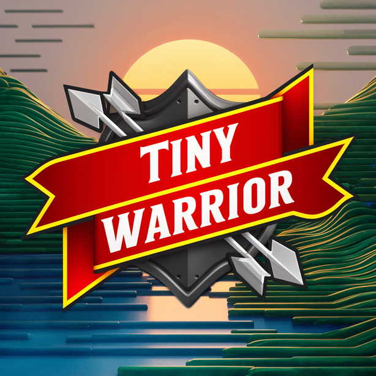

# Olá, meu nome é Celso Gonçalves esse é meu jogo em Godot

## Tiny Warrior
É um jogo de ação 2D desenvolvido usando o Godot Engine.

O jogo envolve combate, coleta de ouro, e gerenciamento de vida e  morte dos personagens. 

Neste jogo, você controla um pequeno guerreiro que deve enfrentar monstros e coletar itens para 
sobreviver o máximo de tempo possível.

Cada carne vermelha regenera 10% da sua vida e as carnes douradas 50%, toda bolsa de ouro coletada 
rendem 10 moedas de ouro que são somadas ao seu placar. 

## Comandos básicos
| Ações  |                    Teclas                     |
|--------|-----------------------------------------------|
| Mover  |           A,W,D,S ou teclas de seta           |
|        |                                               |
| Atacar |     Enter, Espaço, Botão esquerdo mouse       |
|        |                                               |
| Ritual |  É um ataque em área disparado automaticamente| 
|        |             de tempos em tempos               |

## Sumário
- Sobre o Repositório
- Recursos do Jogo
- Pré-requisitos
- Instalação
- Configurações e Preparações
- Como Jogar
- Estrutura do Projeto
- Links Úteis e Contato
- Contribuição

## Sobre o Jogo
Aprendemos a desenvolver jogos do zero, começando nos fundamentos básicos 
do que é um jogo, aprendendo a desenvolver utilizando Godot, e criar jogos 
completos que poderão ser usados para construir um portfólio.

## Recursos do Jogo
Movimentação do personagem com animações de corrida e ataque.

Sistema de combate com ataques em diferentes direções.

Inimigos com comportamento de ataque e dano.

Itens coletáveis como bolsas de ouro que aumentam a pontuação do jogador.

Tela de Game Over com estatísticas da partida.

## Pré-requisitos
Godot Engine 4.x

Git

## Instalação
Clone o repositório do GitHub para o seu computador:

Copiar código

git clone https://github.com/goncl/Tiny-Warrior.git

Crie no seu pc uma pasta e dentro dela abra o git bash e digite o codigo

para cronar o projeto dentro da pasta

Abra o projeto no Godot Engine:

Abra o Godot Engine.

Clique em Import e navegue até a pasta onde você clonou o repositório.

Selecione o arquivo project.godot e clique em Import & Edit.

## Configurações e Preparações
Passos para Configurar o Projeto

Baixar e Instalar Godot:

Godot Engine

Criar um Novo Projeto:

Abra o Godot e crie um novo projeto.

Defina o caminho e o nome do projeto.

Adicionar Cenas e Scripts:

Crie as cenas principais como Player, Enemy, e GameOverUI.

Adicione os scripts fornecidos (Player.gd, Enemy.gd, gold_bag.gd) às 
respectivas cenas.

Configurar Propriedades no Editor:

Configure os nodos e suas propriedades no editor. Por exemplo, defina 
gold_bag_scene nos inimigos para apontar para a cena gold_bag.tscn.

Ajuste os valores de z_index para garantir a correta ordem de desenho 
dos objetos.

Implementar Lógica de Jogo:

Utilize os scripts fornecidos para implementar a lógica de movimentação, combate, coleta de itens, e game over.

Configurações Importantes

Definir z_index:

Defina z_index maior para objetos que devem aparecer sobre outros.

Exemplo: death_object.z_index = 1 e gold_bag.z_index = 0.

Conectar Sinais:

Conecte sinais como body_entered para detectar colisões e interações.

Execução do Projeto

## Como Jogar:
Para executar o projeto:

Acesse o link do jogo [https://goncl.itch.io/tiny-warrior](https://goncl.itch.io/tiny-warrior) e jogue on line.
	
Abrir o Projeto no Godot:

Abra o Godot e selecione o projeto.

Rodar a Cena Principal:

Selecione a cena principal (main.tscn ou equivalente) e clique em "Play" 

para iniciar o jogo.

Use as teclas de seta ou W, A, S e D para mover o personagem.

Pressione a tecla de ataque (space ou Enter ou botão direito do mouse) para 
atacar os inimigos.

Colete bolsas de ouro e itens para aumentar sua pontuação e carnes para 
regenerar sua vida.

Tente sobreviver o máximo de tempo possível. Quando o personagem morrer, 
a tela de Game Over mostrará suas estatísticas.

## Estrutura do Projeto:
ress/: Pasta raiz do projeto que armazena recursos gerais usados no jogo.

addons/: Contém plugins adicionais que Contém recursos visuais usados no jogo.

enemies/: Armazena cenas e scripts relacionados aos inimigos do jogo.

exports/: Destinada a armazenar arquivos de exportação e builds do jogo para 
diferentes plataformas.

misc/: Contém recursos e scripts diversos que não se encaixam em outras 
categorias específicas como cenas e scripts das carnes bolsa de ouro morte do player e
do ataque em area.

player/: Contém cenas e scripts relacionados ao jogador, como a lógica de 
movimentação e ataques.

soundsFX/: Armazena efeitos sonoros usados no jogo.

systems/: Contém scripts que gerenciam sistemas gerais do jogo, como criação 
de inimigos e gerenciamento de itens e da dificuldade do jogo.

test_scenes/: Destinada a cenas de teste usadas durante o desenvolvimento 
para testar funcionalidades específicas.

ui/: Contém cenas e scripts relacionados à interface do usuário, como menus e 
cena de encerramento do jogo.

## Arquivos Principais:
game_manager.gd: Script que gerencia o estado geral do jogo, incluindo controle 
de pontuação, vidas e lógica de fim de jogo.

main.gd: Script principal que inicializa o jogo e configura cenas básicas.

Player.gd: Script do jogador com funcionalidades de movimento, ataque, 
dano, e coleta de ouro.

Enemy.gd: Script dos inimigos com funcionalidades de dano, morte, e drops 
de itens.

gold_bag.gd: Script da bolsa de ouro que lida com a coleta e atualização 
do placar.

GameOverUI.tscn: Cena de interface de usuário para a tela de game over.

## Links Úteis
Link do jogo [https://goncl.itch.io/tiny-warrior](https://goncl.itch.io/tiny-warrior)

Link GitHub do repositório do jogo [https://github.com/goncl/Tiny-Warrior](https://github.com/goncl/Tiny-Warrior)

Efeitos sonoros para jogos[https://sfbgames.itch.io/chiptone](https://sfbgames.itch.io/chiptone)

Como colocar sons no seu jogo [https://www.youtube.com/watch?v=s-P0kuHBOAU&t=8s](https://www.youtube.com/watch?v=s-P0kuHBOAU&t=8s)

Criando o MENU PRINCIPAL no GODOT [https://www.youtube.com/watch?v=pjQ_PHwe5WM](https://www.youtube.com/watch?v=pjQ_PHwe5WM)

IA para criação de logos e imagens [https://ideogram.ai/login](https://ideogram.ai/login)

[Documentação do Godot Engine](https://docs.godotengine.org/pt-br/4.x/index.html)

[Godot Tutorials - HeartBeast](https://www.youtube.com/@uheartbeast/featured)

[Godot Engine Q&A](https://godotengine.org/download/windows/)

[Git](https://git-scm.com/downloads)

[GitHub](https://github.com/)

## Contato
Para quaisquer dúvidas ou sugestões, entre em contato através 
de goncl7@gmail.com

## Contribuição
Se você quiser contribuir para o projeto, sinta-se à vontade para abrir um 
pull request ou reportar issues no GitHub.

